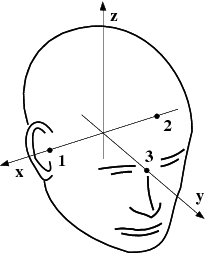

<!-- filename: workflow.md -->

# 1. Overview

The _flow_diagram_ shows what have to be done.

[Official Documentation](https://mne.tools/stable/overview/cookbook.html#flow-diagram)

# 2. Preprocessing

Preprocessing steps are the left-top part of the _flow_diagram_.
These analysis are performed in channel domain.

## 2.1 Bad channels identified

Not found bad channels yet.

## 2.2 Filter on desired passband

Pass band is set to 1.0 ~ 50.0 Hz.
The lower edge chosen is because of ICA (see below).

## 2.3 Artifacts suppressing

Depress artifacts using [ICA](https://mne.tools/stable/generated/mne.preprocessing.ICA.html?highlight=ica#mne.preprocessing.ICA) since our data contains not ecg channel.

> ICA is sensitive to low-frequency drifts and therefore requires the data to be high-pass filtered prior to fitting. Typically, a cutoff frequency of 1 Hz is recommended.

| Script                                | Description                                          |
| ------------------------------------- | ---------------------------------------------------- |
| `Step-01-Calculate_ICA_components.py` | ICA decomposition.                                   |
| `Step-02-Mark_bad_ICA_components.py`  | Bad components identified and components depressing. |

# 3 Epoching and evoked data

Compute evoked and plot it.
| Script | Description |
|--------|-------------|
| `Step-03-Save_epochs.py` | Get epochs and save them. |
| `Step-04-Plot_evoked.py` | Plot evoked in time series manner. |
| `Step-05-Plot_evoked_freq.py` | Plot evoked in frequency domain manner. |

We also perform [time-frequency analysis](https://mne.tools/stable/auto_examples/time_frequency/plot_time_frequency_simulated.html?highlight=wavelet) in Step-05, using [morlet wavelet](https://mne.tools/stable/generated/mne.time_frequency.tfr_morlet.html#mne.time_frequency.tfr_morlet).

# 4 Source locations

Source location steps are the right-top part of the _flow_diagram_.
These analysis are performed in source domain.

See [Sources_analysis_demos folder](Source_analysis_demos/) for detail.

## 4.1 Anatomical information

Anatomical information analysis uses `Cortical surface reconstruction` with [FreeSurfer](https://surfer.nmr.mgh.harvard.edu/fswiki/RecommendedReconstruction).
FreeSurfer is also combained with MNE [(Find how)](https://mne.tools/stable/auto_tutorials/source-modeling/plot_background_freesurfer.html#tut-freesurfer).

| Command       | Description                                              |
| ------------- | -------------------------------------------------------- |
| `mri_convert` | Convert IMA files into .nii file. IMA files are T1 image |
| `recon-all`   | Perform FreeSurfer analysis pipeline.                    |

### 4.1.1 Setting up the source space

After that we can set up the source space.

1. Creating a suitable decimated dipole grid on the white matter surface.
   Using [_mne.setup_source_space()_](https://mne.tools/stable/generated/mne.setup_source_space.html#mne.setup_source_space).
2. Creating the source space file in fif formate. Using [_mne.write_source_spaces()_](https://mne.tools/stable/generated/mne.write_source_spaces.html#mne.write_source_spaces).

Recommended subdivisions of an icosahedron and an octahedron for the creation of source spaces. The approximate source spacing and corresponding surface area have been calculated assuming a 1000-cm2 surface area per hemisphere.  
For example, to create the reconstruction geometry for subject='sample' with a ~5-mm spacing between the grid points, say:

    src = setup_source_space('sample', spacing='oct6')
    write_source_spaces('sample-oct6-src.fif', src)
    src = read_source_spaces('sample-oct6-src.fif')
    mne.viz.plot_alignment('sample', surfaces='white', coord_frame='head', src=src)

_`src`_ is [mne.SourceSpaces](https://mne.tools/stable/generated/mne.SourceSpaces.html#mne.SourceSpaces), represent a list of source space. Currently implemented as a list of dictionaries containing the source space information.

| Paramaters    |                                                                                                                         |
| ------------- | ----------------------------------------------------------------------------------------------------------------------- |
| source_spaces | A list of dictionaries containing the source space information.                                                         |
| info          | Dictionary with information about the creation of the source space file. Has keys _‘working_dir’_ and _‘command_line’_. |

A Table of different spacing types

| spacing | Sources per hemisphere | Source spacing | Surface area per source |
| :-----: | :--------------------: | :------------: | :---------------------: |
| 'oct5'  |          1026          |      9.9       |           97            |
| 'ico4'  |          2562          |      6.2       |           39            |
| 'oct6'  |          4098          |      4.9       |           24            |
| 'ico5'  |         10242          |      3.1       |           9.8           |

### 4.1.2 Creating the BEM model meshes

BEM is [Boundary Element Model](https://mne.tools/stable/overview/implementation.html#bem-model).
BEM can be calculated using the watershed algorithm.
Its use in MNE environment is facilitated by the script [mne watershed_bem](https://mne.tools/stable/generated/commands.html#gen-mne-watershed-bem).
After `mne watershed_bem` has completed, the following files appear in the subject's `bem/watershed` directory:

| Files                           |                                                    |
| ------------------------------- | -------------------------------------------------- |
| `<subject>_brain_surface`       | The brain surface triangulation.                   |
| `<subject>_inner_skull_surface` | The inner skull triangulation.                     |
| `<subject>_outer_skull_surface` | The outer skull triangulation.                     |
| `<subject>_outer_skin_surface`  | The scalp triangulation.                           |
| `bem/watershed/ws`              | The brain MRI volume. _(I have not found it yet.)_ |
| `bem/<subject>-head.fif`        | The scalp surface to fif format                    |

### 4.1.3 Setting the head surface triangulation files

This stage sets up the subject-dependent data for computing the forward solutions:

    model = make_bem_model('sample')
    write_bem_surfaces('sample-5120-5120-5120-bem.fif', model)
    # where `surfaces` is a list of BEM surfaces

`surfaces` can be read using [mne.read_surface()](https://mne.tools/stable/generated/mne.read_surface.html#mne.read_surface).  
This step also checks that the input surfaces are complete and that they are topologically correct, i.e., that the surfaces do not intersect and that the surfaces are correctly ordered (outer skull surface inside the scalp and inner skull surface inside the outer skull).

Using this model, the BEM solution can be computed using [mne.make_bem_solution()](https://mne.tools/stable/generated/mne.make_bem_solution.html#mne.make_bem_solution) as:

    bem_sol = make_bem_solution(model)
    write_bem_solution('sample-5120-5120-5120-bem-sol.fif', bem_sol)

After the BEM is set up it is advisable to check that the BEM model meshes are correctly positioned using e.g. [mne.viz.plot_alignment()](https://mne.tools/stable/generated/mne.viz.plot_alignment.html#mne.viz.plot_alignment) or [mne.Report](https://mne.tools/stable/generated/mne.Report.html#mne.Report).

## 4.2 Aligning coordinate frames

The calculation of the forward solution requires knowledge of the relative location and orientation of the MEG/EEG and MRI coordinate systems (see [The head and device coordinate systems](https://mne.tools/stable/overview/implementation.html#head-device-coords)).

The corregistration is stored in `-trans.fif` file.
Use [mne.gui.coregistration()](https://mne.tools/stable/generated/mne.gui.coregistration.html#mne.gui.coregistration) or [mne coreg](https://mne.tools/stable/generated/commands.html#gen-mne-coreg) to create.

> 
> `The head and device coordinate systems`  
> The MEG/EEG head coordinate system employed in the MNE software is a right-handed Cartesian coordinate system. The direction of x axis is from left to right, that of y axis to the front, and the z axis thus points up.  
> The x axis of the head coordinate system passes through the two periauricular or preauricular points digitized before acquiring the data with positive direction to the right. The y axis passes through the nasion and is normal to the x axis. The z axis points up according to the right-hand rule and is normal to the xy plane.  
> The origin of the MEG device coordinate system is device dependent. Its origin is located approximately at the center of a sphere which fits the occipital section of the MEG helmet best with x axis axis going from left to right and y axis pointing front. The z axis is, again, normal to the xy plane with positive direction up.

## 4.3 Computing the forward solution

After the MRI-MEG/EEG alignment has been set, the forward solution, i.e., the magnetic fields and electric potentials at the measurement sensors and electrodes due to dipole sources located on the cortex, can be calculated with help of [mne.make_forward_solution()](https://mne.tools/stable/generated/mne.make_forward_solution.html#mne.make_forward_solution) as:

    fwd = make_forward_solution(raw.info, trans, src, bem_sol)

| Input variables |                                        |
| --------------- | -------------------------------------- |
| _`raw.info`_    | Info of raw instance, raw is necessary |
| _`trans`_       | Path of _`-trans.fif`_ (trans file)    |
| _`src`_         | Path of _`src`_ (SourceSpace)          |
| _`bem_sol`_     | Path of _`bem_sol`_ (BEM solution)     |

## 4.4 Computing the noise-covariance matrix

The MNE software employs an estimate of the noise-covariance matrix to weight the channels correctly in the calculations.
The noise-covariance matrix provides information about field and potential patterns representing uninteresting noise sources of either human or environmental origin.

The noise covariance matrix can be calculated in several ways:

    # Compute covariance matrix using experimental data
    cov = mne.compute_covariance(epochs, method='auto')
    # Compute covariance matrix using empty room data
    cov = mne.compute_raw_covariance(raw_erm)

- Employ the individual epochs during off-line averaging to calculate the full noise covariance matrix. This is the recommended approach for evoked responses, e.g. [using mne.compute_covariance()](https://mne.tools/stable/generated/mne.compute_covariance.html#mne.compute_covariance):

- Employ empty room data (collected without the subject) to calculate the full noise covariance matrix. This is recommended for analyzing ongoing spontaneous activity. This can be done using [mne.compute_raw_covariance()](https://mne.tools/stable/generated/mne.compute_raw_covariance.html#mne.compute_raw_covariance) as:  
  `Employ a section of continuous raw data collected in the presence of the subject to calculate the full noise covariance matrix.` This is the recommended approach for analyzing epileptic activity. The data used for this purpose should be `free of technical artifacts and epileptic activity of interest.`  
  The length of the data segment employed should be `at least 20 seconds`. One can also use a long `(*> 200 s)` segment of data with epileptic spikes present provided that the spikes occur infrequently and that the segment is apparently stationary with respect to background brain activity. This can also use [mne.compute_raw_covariance()](https://mne.tools/stable/generated/mne.compute_raw_covariance.html#mne.compute_raw_covariance).

## 4.5 Calculating the inverse operator

The MNE software doesn’t calculate the inverse operator explicitly but rather `computes an SVD of a matrix composed of the noise-covariance matrix`, the result of the forward calculation, and the source covariance matrix.
This approach has the benefit that the regularization parameter (‘SNR’) can be adjusted easily when the final source estimates or dSPMs are computed. For mathematical details of this approach, please consult [Minimum-norm estimates](https://mne.tools/stable/overview/implementation.html#minimum-norm-estimates).

This computation stage can be done by using [mne.minimum_norm.make_inverse_operator()](https://mne.tools/stable/generated/mne.minimum_norm.make_inverse_operator.html#mne.minimum_norm.make_inverse_operator) as:  
 inv = mne.minimum_norm.make_inverse_operator(raw.info, fwd, cov, loose=0.2)

## 4.6 Creating source estimates

Once all the preprocessing steps described above have been completed.

    # The inverse operator computed can be applied to the MEG and EEG data as:
    stc = mne.minimum_norm.apply_inverse(evoked, inv, lambda2=1. / 9.)
    # And the results can be viewed as:
    stc.plot()
    # stc is the source estimates for all epochs. list of (SourceEstimate | VectorSourceEstimate | VolSourceEstimate).

## 4.7 Group analyses

Group analysis is facilitated by morphing source estimates, which can be done e.g., to `subject='fsaverage'` as:

    morph = mne.compute_source_morph(stc, subject_from='sample', subject_to='fsaverage')
    stc_fsaverage = morph.apply(stc)
