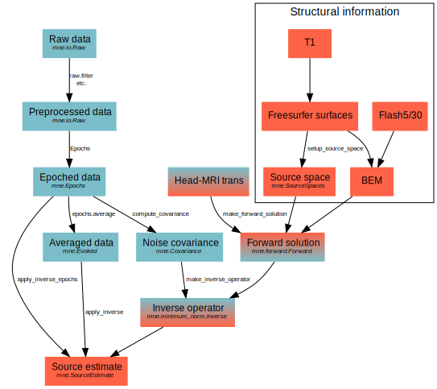

<!-- filename: workflow.md -->

# Overview
## The _flow_diagram_ shows what have to be done.

[Official Documentation](https://mne.tools/stable/overview/cookbook.html#flow-diagram)

# Preprocessing
Preprocessing steps are the left-top part of the _flow_diagram_.

These analysis are performed in channel domain.

## Bad channels identified
Not found bad channels yet.

## Filter on desired passband
Pass band is set to 1.0 ~ 50.0 Hz.
The lower edge chosen is because of ICA (see below).

## Artifacts suppressing
Depress artifacts using [ICA](https://mne.tools/stable/generated/mne.preprocessing.ICA.html?highlight=ica#mne.preprocessing.ICA).
>ICA is sensitive to low-frequency drifts and therefore requires the data to be high-pass filtered prior to fitting. Typically, a cutoff frequency of 1 Hz is recommended.

My dataset contains not ecg channels.

| Script | Description |
|--------|-------------|
| Step-01-Calculate_ICA_components.py | ICA decomposition. |
| Step-02-Mark_bad_ICA_components.py | Bad components identified and components depressing.|

## Epoching and evoked data

| Script | Description |
|--------|-------------|
| Step-03-Save_epochs.py | Get epochs and save them. |
| Step-04-Plot_evoked.py | Plot evoked in time series manner. |
| Step-05-Plot_evoked_freq.py | Plot evoked in frequency domain manner. |

We also perform [time-frequency analysis](https://mne.tools/stable/auto_examples/time_frequency/plot_time_frequency_simulated.html?highlight=wavelet) in Step-05, using [morlet wavelet](https://mne.tools/stable/generated/mne.time_frequency.tfr_morlet.html#mne.time_frequency.tfr_morlet).

# Source locations
Source location steps are the right-top part of the _flow_diagram_.

These analysis are performed in source domain.

## Anatomical information
Cortical surface reconstruction with [FreeSurfer](https://surfer.nmr.mgh.harvard.edu/fswiki/RecommendedReconstruction).
FreeSurfer is also combained with MNE [(Find how)](https://mne.tools/stable/auto_tutorials/source-modeling/plot_background_freesurfer.html#tut-freesurfer).

| Command | Description |
|--------|-------------|
| mri_convert | Convert IMA files into .nii file. IMA files are T1 image  |
| recon-all | Perform FreeSurfer analysis pipeline. |

After that we can set up the source space.

1. Creating a suitable decimated dipole grid on the white matter surface.
Using [_mne.setup_source_space()_](https://mne.tools/stable/generated/mne.setup_source_space.html#mne.setup_source_space).
2. Creating the source space file in fif formate. Using [_mne.write_source_spaces()_](https://mne.tools/stable/generated/mne.write_source_spaces.html#mne.write_source_spaces).

>Recommended subdivisions of an icosahedron and an octahedron for the creation of source spaces. The approximate source spacing and corresponding surface area have been calculated assuming a 1000-cm2 surface area per hemisphere. 
For example, to create the reconstruction geometry for subject='sample' with a ~5-mm spacing between the grid points, say: 
>>_src = setup_source_space('sample', spacing='oct6')_  
>>_write_source_spaces('sample-oct6-src.fif', src)_  

>|spacing|Sources per hemisphere|Source spacing|Surface area per source|
>|:-----:|:--------------------:|:------------:|:---------------------:|
>|'oct5'|1026|9.9|97|
>|'ico4'|2562|6.2|39|
>|'oct6'|4098|4.9|24|
>|'ico5'|10242|3.1|9.8|

